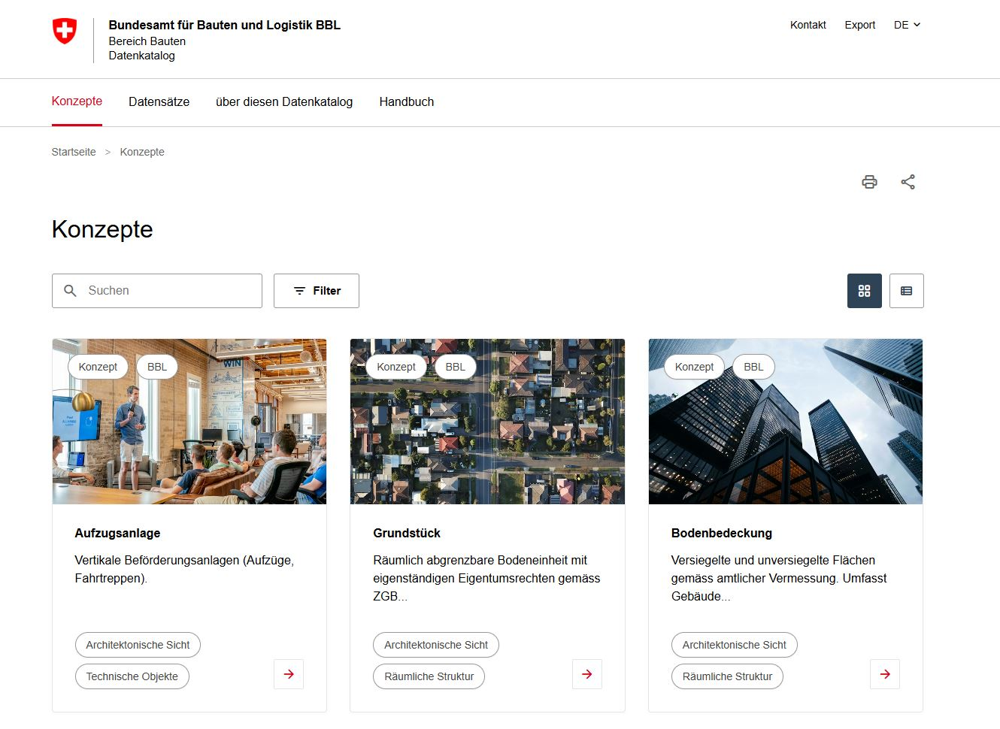

# BBL Buildings Data Catalog (meta-bv)

A data catalog for the Swiss Federal Office for Buildings and Logistics (BBL). Documents business objects and datasets according to the DCAT-AP CH v3.0 standard.

- Deployed: https://davras5.github.io/meta-bv/



## Features

- Browse business object concepts and datasets with full metadata
- Full-text search across titles, descriptions, and tags
- Filter by tags, system, classification, and personal data status
- Grid and list view modes
- Print and share functionality
- Mobile-responsive design

## Tech Stack

| Technology | Purpose |
|------------|---------|
| HTML5 | Structure and semantic markup |
| CSS3 | Styling with CSS variables |
| Vanilla JavaScript | Hash-based routing, dynamic UI |
| JSON | Data storage |

**Zero dependencies** - No build step, runs directly in any browser.

## Getting Started

```bash
# Clone the repository
git clone https://github.com/davras5/meta-bv.git
cd meta-bv

# Start a local server
python3 -m http.server 8000

# Open http://localhost:8000
```

## Project Structure

```
meta-bv/
├── index.html              # Single-file web application
├── content/
│   ├── about.html          # About page
│   └── manual.html         # User manual
├── data/
│   ├── concepts.json       # Business object definitions
│   └── datasets.json       # Dataset definitions
└── images/
    ├── concepts/           # Concept images
    └── datasets/           # Dataset images
```

## License

[CC BY 4.0](https://creativecommons.org/licenses/by/4.0/)

---

*Unofficial mockup for demonstration purposes.*
